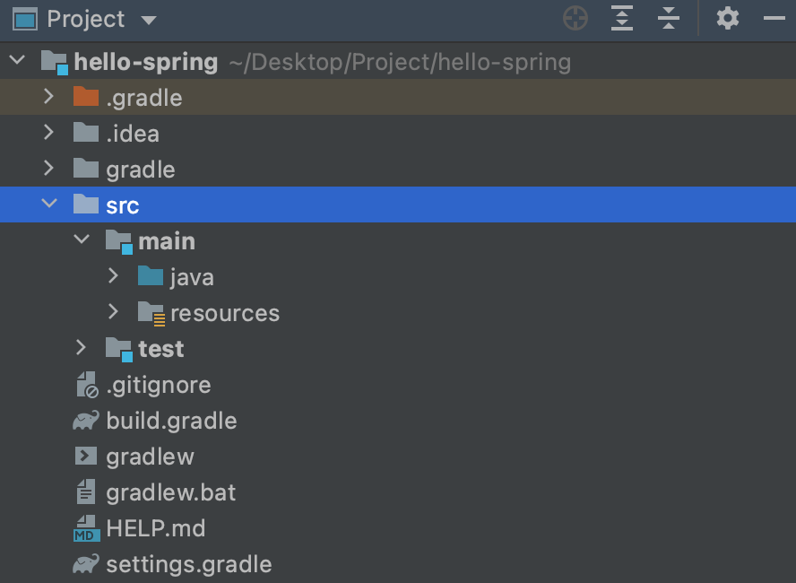
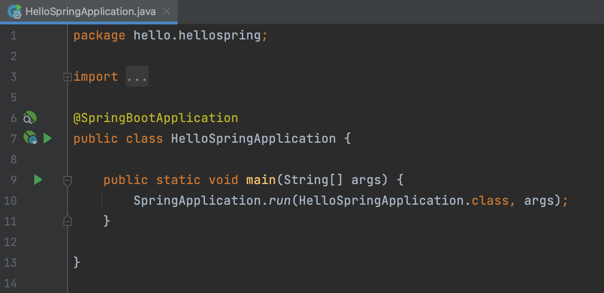
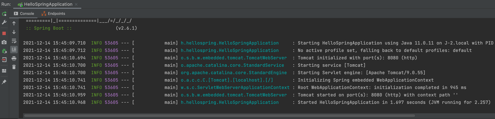
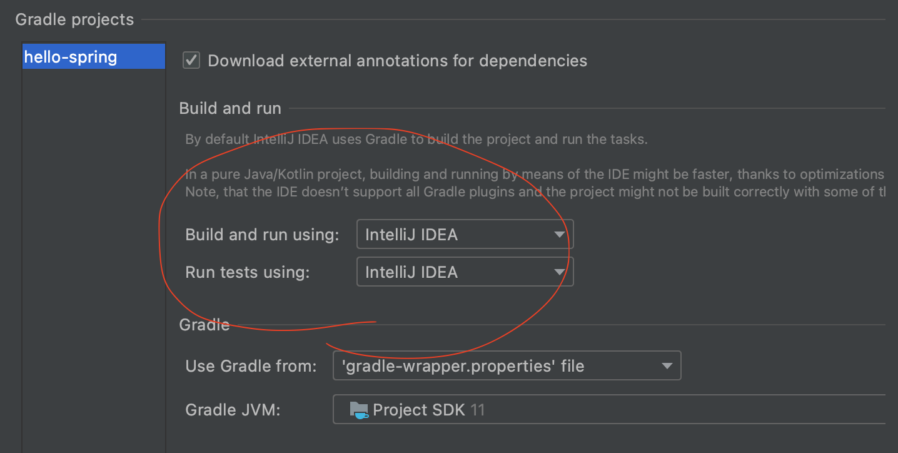

# 211214_TIL

### Spring 시작하기

h2 데이터베이스는 다음 링크에 들어가서 **1.4.200** 버전을 설치한다.

- [https://www.h2database.com/html/download.html](https://www.h2database.com/html/download.html)

### 프로젝트 생성

사전 준비물

- Java 11
- IntelliJ (IDE)

스프링 부트 스타터 사이트로 이동해서 스프링 프로젝트 생성

- [https://start.spring.io/](https://start.spring.io/)

](./image/211214_TIL/1.png)

프로젝트 선택

- Project: Gradle Project
- Spring Boot: SNAPSHOT 또는 M1을 제외한 최신버전
- Language: Java
- Packaging: Jar
- Java: 11

Project Metadata

- groupId: hello
- artifactId: hello-spring

Dependencies

- Spring Web
- Thymeleaf

### 프로젝트 구조

- .idea: IntelliJ가 사용하는 설정 폴더
- gradle: gradle을 사용하는 폴더
- src: main 폴더와 test 폴더로 구성
    - main: java 폴더와 resources 폴더로 구성
        - java: 실제 패키지와 소스 파일이 포함
        - resources: java 파일을 제외한 xml, property, html 등 설정 파일이 포함
    - test: 테스트 코드와 관련된 소스 파일이 포함
- build.gradle: 가장 핵심이 되는 파일

### 동작 확인

- src → main → java → hello.hellospring → HelloSpringApplication.java
- main 줄(9번째 줄)에 있는 녹색 화살표를 클릭하여 실행

HelloSpringApplication.java

- 스프링 부트 메인 실행 후 에러페이지로 간단하게 동작 확인
- [http://localhost:8080](http://localhost:8080/)

스프링 부트 메인 실행 콘솔창

](./image/211214_TIL/5.png)

[http://localhost:8080](http://localhost:8080/)

### 설정 변경

- Preferences → Build, Execution, Deployment → Build Tools → Gradle
    - Build and run using: Gradle → IntelliJ IDEA
    - Run tests using: Gradle → IntelliJ IDEA

